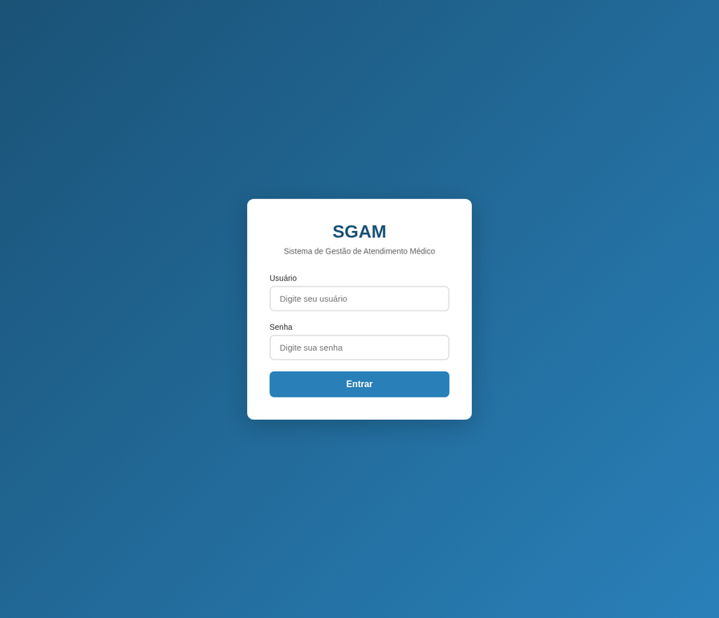
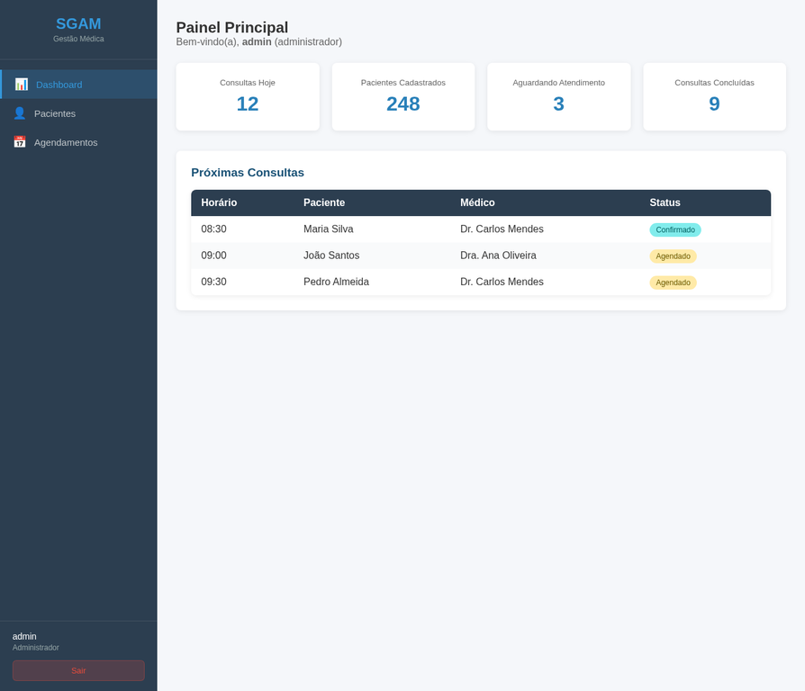
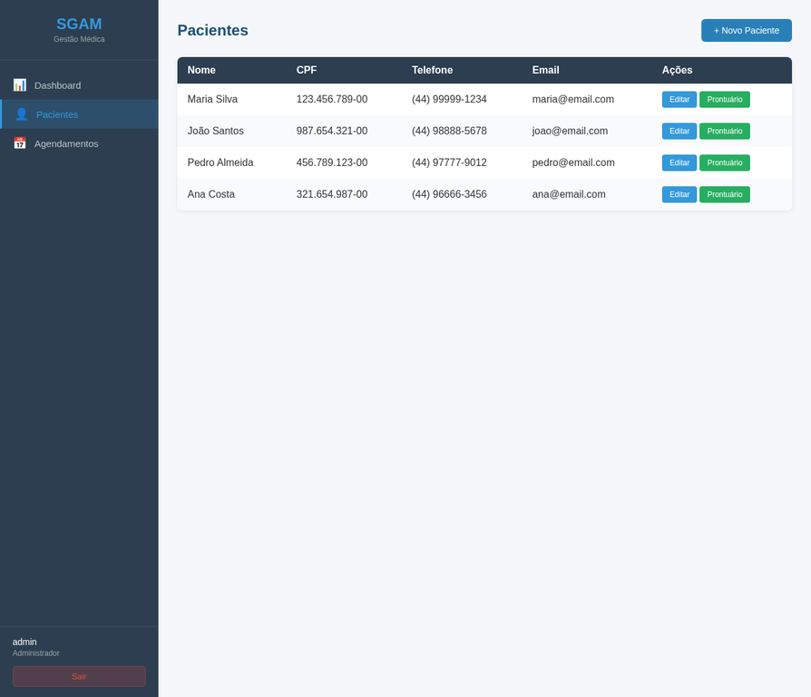
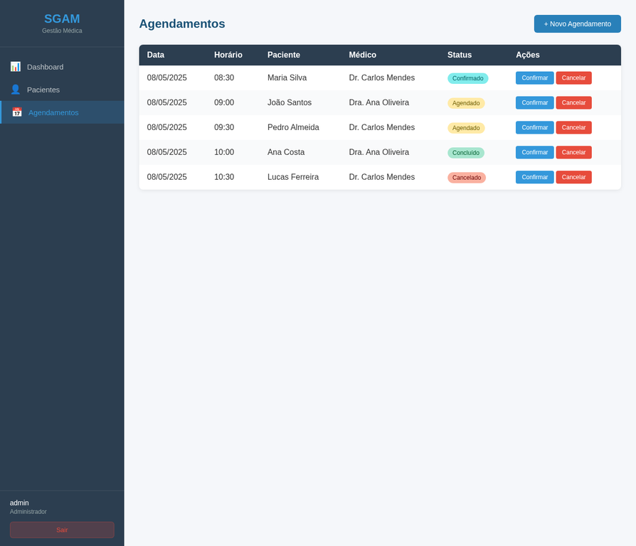
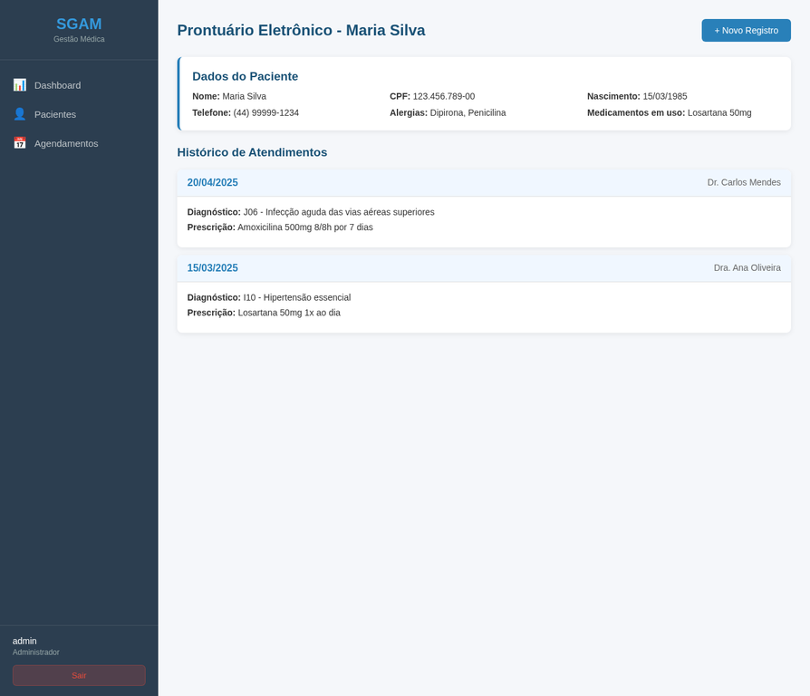

# SGAM - Sistema de Gestão de Atendimento Médico

Sistema de Gestão de Atendimento Médico com Prontuário Eletrônico, desenvolvido como protótipo funcional para o Trabalho de Conclusão de Curso (TCC) do curso de Engenharia de Software da Unicesumar.

## Sobre o Projeto

O SGAM é uma aplicação web que integra funcionalidades essenciais para a gestão de clínicas e consultórios médicos, incluindo:

- Autenticação segura com JWT e controle de acesso por papéis (RBAC)
- Cadastro e gestão de pacientes
- Prontuário eletrônico com histórico de atendimentos
- Agendamento de consultas com validação de conflitos
- Dashboard com métricas operacionais em tempo real
- Logs de auditoria para rastreabilidade

## Screenshots

### Tela de Login


### Dashboard Principal


### Gestão de Pacientes


### Agendamento de Consultas


### Prontuário Eletrônico


## Tecnologias Utilizadas

### Front-end
- React.js 18
- React Router (SPA)
- CSS responsivo
- Axios (requisições HTTP)

### Back-end
- Node.js 18+
- Express.js
- JSON Web Tokens (JWT)
- bcrypt (hash de senhas)

### Banco de Dados
- PostgreSQL 14+
- Redis (cache)
- Criptografia AES-256 para dados sensíveis

## Estrutura do Projeto

```
sistema-gestao-atendimento-medico/
├── backend/
│   ├── src/
│   │   ├── config/         # Configurações (banco de dados)
│   │   ├── controllers/    # Lógica de negócio
│   │   ├── middleware/     # Autenticação e autorização
│   │   ├── models/         # Schema SQL
│   │   └── routes/         # Rotas da API
│   ├── server.js           # Ponto de entrada do servidor
│   ├── package.json
│   └── .env.example
├── frontend/
│   ├── public/
│   ├── src/
│   │   ├── components/     # Componentes reutilizáveis
│   │   ├── pages/          # Páginas da aplicação
│   │   ├── services/       # Serviço de API
│   │   └── styles/         # Estilos CSS
│   └── package.json
├── screenshots/            # Capturas de tela
└── README.md
```

## Funcionalidades

| Módulo | Descrição |
|--------|-----------|
| Autenticação | Login com JWT, sessão segura, logout |
| RBAC | Controle de acesso por perfis (Admin, Médico, Recepcionista) |
| Pacientes | Cadastro completo, histórico, alergias, medicamentos |
| Agendamentos | Marcação, confirmação, cancelamento, validação de conflitos |
| Prontuário | Anamnese, diagnóstico (CID-10), prescrição, histórico |
| Financeiro | Registro de pagamentos vinculados às consultas |
| Auditoria | Log imutável de todas as ações em prontuários |

## Requisitos de Implantação

- Node.js >= 18.x
- PostgreSQL >= 14.x
- Redis (opcional, para cache)
- Nginx (para servir arquivos estáticos em produção)

## Instalação e Execução

### 1. Clonar o repositório
```bash
git clone https://github.com/toyotoshi264/sistema-gestao-atendimento-medico.git
cd sistema-gestao-atendimento-medico
```

### 2. Configurar o Back-end
```bash
cd backend
cp .env.example .env
# Editar .env com suas credenciais do banco
npm install
npm start
```

### 3. Configurar o Front-end
```bash
cd frontend
npm install
npm start
```

### 4. Criar o Banco de Dados
```bash
psql -U postgres -f backend/src/models/schema.sql
```

## Perfis de Acesso (RBAC)

| Perfil | Permissões |
|--------|-----------|
| Administrador | Acesso total ao sistema |
| Médico | Prontuário, consultas, pacientes |
| Recepcionista | Agendamentos, cadastro de pacientes |

## Autor

**Erick Toyotoshi Martins**  
Engenharia de Software - Unicesumar  
TCC II - 2025

## Licença

Este projeto foi desenvolvido para fins acadêmicos.
